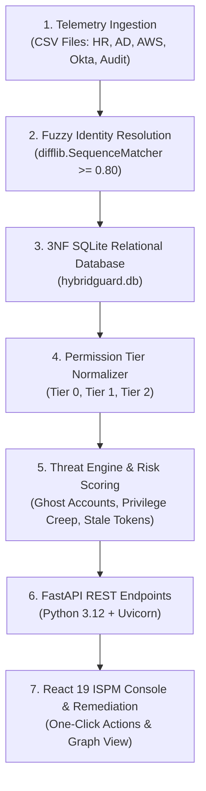
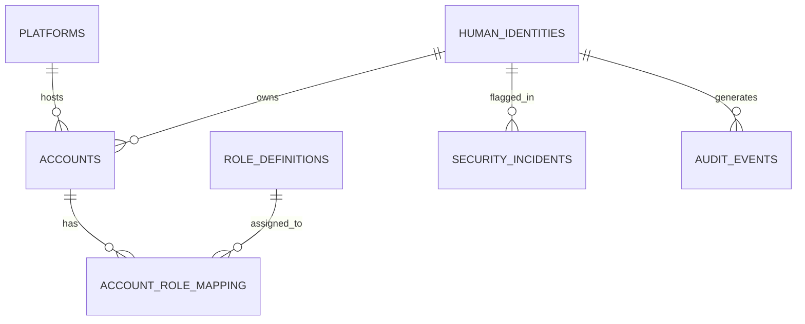

# HybridGuard: Technical Architecture & Project Review Guide

---

## 📌 Executive Overview

**HybridGuard** is an enterprise **Identity Security Posture Management (ISPM)** platform. Modern organizations run identities across multiple fragmented platforms—such as Human Resources (HR), Active Directory (AD), AWS IAM, and Okta. 

In traditional environments:
- HR marks an employee as terminated, but their AWS or Okta account remains active (**Ghost Account**).
- Standard employees accumulate admin credentials over time across different projects (**Privilege Creep**).
- Old API credentials and security tokens are never rotated (**Stale Security Tokens**).

**HybridGuard** bridges these silos by ingesting raw telemetry, correlating identity names using fuzzy string matching, normalizing privilege levels into a 3-tier model, calculating a unified mathematical risk score, and serving actionable 1-click remediation through a FastAPI backend and React 19 dashboard console.

---

## 🏗️ End-to-End System Architecture

HybridGuard executes a **7-Stage Data & Security Pipeline**:



---

## 📁 Project Directory & File Structure

```text
HybridGuard/
│
├── backend/                         # Backend Python Core Logic
│   ├── api.py                       # FastAPI REST API endpoints & CORS middleware
│   ├── db_connection.py             # SQLite database connection module
│   ├── normalize_and_match.py       # Data Extraction, Fuzzy Matching & 3NF Transform
│   └── security_insidents.py        # Threat Rules, Risk Scoring & Remediation Logic
│
├── schema/                          # Database Setup & Synthetic Data Generator
│   ├── simulate_data.py             # Generates realistic synthetic telemetry CSVs
│   ├── tables_creation.py           # DDL schema definition & SQLite views
│   └── clear_data.py                # Database cleanup utility
│
├── csvs/                            # Raw Ingestion Telemetry Data
│   ├── user_details.csv             # HR Master Employee Directory
│   ├── ad_users.csv                 # Active Directory accounts & security groups
│   ├── aws_users.csv                # AWS IAM users & attached policies
│   ├── okta_users.csv               # Okta user identities & assigned roles
│   └── audit_events.csv             # Cross-platform login audit logs
│
├── utils/
│   └── path.py                      # Global file paths & directory constants
│
├── priviguard-dashboard/            # React 19 + Vite Dashboard Frontend
│   ├── src/
│   │   ├── components/              # Overview, Dormancy, Damage, Remediation, Graph Views
│   │   ├── App.jsx                  # Main application state & routing
│   │   ├── index.css                # Global CSS tokens, scrollbars & responsive layout
│   │   └── main.jsx                 # React root entry point
│   └── package.json                 # Frontend dependencies
│
├── main.py                          # Pipeline Orchestrator (Clear -> Normalize -> Incidents)
├── hybridguard.db                   # Relational SQLite 3NF Database
├── package.json                     # Root concurrent launcher (npm run dev)
└── requirements.txt                 # Python dependencies (fastapi, pandas, uvicorn, etc.)
```

---

## 🔍 Deep Dive: The Backend Pipeline

### 1. Data Ingestion & Synthetic Telemetry (`schema/simulate_data.py`)
The pipeline begins by ingesting data from five distinct sources:
- `user_details.csv`: Master HR record containing `name`, `email`, `department`, `status` (`ACTIVE`/`DISABLED`).
- `ad_users.csv`: Windows Active Directory users (`sAMAccountName`, `ad_group`, `status`).
- `aws_users.csv`: AWS IAM user accounts (`username`, `role`, `createdat`, `rotatedat`).
- `okta_users.csv`: Single Sign-On Okta accounts (`username`, `role`, `status`).
- `audit_events.csv`: Platform authentication events (`timestamp`, `platform`, `source_ip`).

---

### 2. Fuzzy Identity Resolution (`backend/normalize_and_match.py`)
**Problem:** Usernames differ across platforms (e.g., HR: `Allison Hill`, AD: `ahill`, AWS: `a.hill`, Okta: `allison.hill1`). Standard exact SQL joins (`ON hr.name = aws.username`) fail completely.

**Solution:** HybridGuard implements a **Fuzzy Name Matching Engine** using Python’s `difflib.SequenceMatcher`:

1. **Username Cleaning (`clean_username`)**: Strips special characters, spaces, and numbers, converting to lower case (e.g., `a.hill_99` ➔ `ahill`).
2. **Pattern Generator (`generate_namepattern`)**: Generates canonical username permutations from an HR full name (`first+last`, `last+first`, `f+last`, `last+f`).
3. **Similarity Ratio Comparison (`get_identity`)**:
   $$\text{Similarity Ratio} = \frac{2 \times M}{T}$$
   *(where $M$ is the number of matching characters and $T$ is total characters)*
   - A threshold of **$\ge 0.80$ (80%)** correlates messy usernames to the official HR master identity ID. Accounts below 0.80 are flagged as potential orphan accounts.

---

### 3. Database Management System (DBMS) & 3NF Normalization

HybridGuard uses **SQLite** with a strictly normalized **Third Normal Form (3NF)** schema to eliminate data redundancy and insertion/update/deletion anomalies.

#### ER Entity Relationships:
- **`human_identities` (1) ➔ (N) `accounts`**: A single human employee can hold accounts across multiple platforms (AD, AWS, Okta).
- **`platforms` (1) ➔ (N) `accounts`**: Each account belongs to one specific platform.
- **`accounts` (N) ➔ (M) `role_definitions`**: Solved via junction table **`account_role_mapping`**.
- **`human_identities` (1) ➔ (N) `security_incidents`**: Security violations are tied directly to master identity IDs.



#### Database Tables Schema:

1. **`human_identities`**: Master HR table.
   - `identity_id` (PK, INTEGER)
   - `full_name` (TEXT)
   - `email` (TEXT UNIQUE)
   - `hr_status` (TEXT: 'ACTIVE', 'DISABLED')

2. **`platforms`**: Platform lookup.
   - `platform_id` (PK, INTEGER: 1=AD, 2=AWS, 3=Okta)
   - `platform_name` (TEXT UNIQUE)

3. **`accounts`**: System platform accounts.
   - `account_id` (PK, TEXT e.g. 'AWS-101')
   - `identity_id` (FK ➔ `human_identities`)
   - `platform_id` (FK ➔ `platforms`)
   - `platform_username` (TEXT)
   - `account_status` (TEXT: 'ACTIVE', 'DISABLED')
   - `token_created_date`, `token_rotated_date`, `last_login_date` (DATETIME)

4. **`role_definitions`**: Raw platform roles mapped to normalized privilege tiers.
   - `role_id` (PK, INTEGER)
   - `platform_id` (FK ➔ `platforms`)
   - `raw_role_name` (TEXT)
   - `normalized_tier` (TEXT: 'Tier 0', 'Tier 1', 'Tier 2')

5. **`account_role_mapping`**: Junction table.
   - `account_id` (FK ➔ `accounts`)
   - `role_id` (FK ➔ `role_definitions`)

6. **`security_incidents`**: Security violation backlog.
   - `incident_id` (PK, INTEGER)
   - `identity_id` (FK ➔ `human_identities`)
   - `incident_type` (TEXT: 'Ghost Account', 'Privilege Creep', 'Stale Security Token')
   - `severity` (TEXT: 'CRITICAL', 'HIGH', 'MEDIUM')
   - `platform` (TEXT)
   - `description` (TEXT)
   - `elevated_tier` (TEXT)

7. **`live_privileged_watchlist` (SQL View)**:
   Real-time SQL View aggregating highest tier held, total days dormant (`julianday('now') - julianday(last_activity)`), and active account counts.

---

### 4. Privilege Normalization & 3-Tier Hierarchy

Different platforms use custom role names. HybridGuard normalizes them into a unified 3-Tier model (`normalize_role()`):

| Tier Level | Risk Weight | Roles Included | Platform Examples |
| :--- | :---: | :--- | :--- |
| **Tier 0** *(Critical Admin)* | **100** | Domain Admins, Enterprise Admin, AdministratorAccess, SuperAdmin | AWS `AdministratorAccess`, AD `Domain Admins` |
| **Tier 1** *(Elevated Power User)* | **50** | ApplicationAdmin, Server Operators, EC2FullAccess, InternalToolsAdmin | AWS `EC2FullAccess`, Okta `ApplicationAdmin` |
| **Tier 2** *(Standard User)* | **10** | Domain Users, ReadOnlyAccess, Backup Operator, Standard User | AWS `ReadOnlyAccess`, AD `Domain Users` |

---

### 5. Automated Threat Detection Rules Engine (`backend/security_insidents.py`)

HybridGuard automatically scans the normalized 3NF SQLite database to detect three primary threat vectors:

#### A. Ghost Account Detection (Severity: CRITICAL)
- **Condition:** Employee is marked `DISABLED` in HR (`human_identities.hr_status = 'DISABLED'`), but still possesses an `ACTIVE` account on AD, AWS, or Okta (`accounts.account_status = 'ACTIVE'`).
- **Risk:** High probability of insider threat, unauthorized former-employee access, or lingering backdoor access.

#### B. Privilege Creep Detection (Severity: HIGH)
- **Condition:** Employee's baseline HR role is standard (**Tier 2** or **Tier 1**), but they hold elevated administrative access (**Tier 1** or **Tier 0**) on an external platform.
- **Risk:** Violation of the Principle of Least Privilege (PoLP).

#### C. Stale Security Token Detection (Severity: MEDIUM)
- **Condition:** Account status is `ACTIVE` on AWS or Okta, but `token_rotated_date` is `NULL`, empty, or older than 30 days.
- **Risk:** Vulnerable to credential theft, token replay attacks, and key leakage.

---

### 6. Unified Risk Scoring Engine

HybridGuard computes two independent threat metrics and combines them into an overall **Unified Risk Score (0 - 100)** for every identity:

#### 1. Damage Score (Blast Radius)
Calculated based on the highest privilege tier held by an active identity:
$$\text{Damage Score} = \begin{cases} 0 & \text{if HR Status} = \text{'DISABLED'} \\ 100 & \text{if Highest Tier} = \text{'Tier 0'} \\ 50 & \text{if Highest Tier} = \text{'Tier 1'} \\ 10 & \text{if Highest Tier} = \text{'Tier 2'} \end{cases}$$

#### 2. Dormancy Score (Inactivity Metric)
Calculated based on days since last platform login:
$$\text{Dormancy Score} = \begin{cases} 100 & \text{if Days Dormant} \ge 90 \text{ or NULL} \\ 50 & \text{if Days Dormant} \ge 60 \\ 10 & \text{if Days Dormant} \ge 30 \\ 0 & \text{otherwise} \end{cases}$$

#### 3. Overall Unified Risk Score Formula
$$\text{Risk Score} = (\text{Damage Score} \times 0.4) + (\text{Dormancy Score} \times 0.3) + (\text{HR Status Factor} \times 0.3)$$
*(where HR Status Factor is 100.0 if `DISABLED`, else 0.0)*

#### Flagged Risk Factors:
Identities are assigned human-readable tags:
- `high_privilege` (Damage Score $\ge 50$)
- `dormant_account` (Dormancy Score $\ge 50$)
- `ghost_account` (HR Status = `DISABLED`)

---

### 7. FastAPI REST API Layer (`backend/api.py`)

The backend exposes FastAPI endpoints consumed by the React frontend:

| Endpoint | Method | Purpose |
| :--- | :---: | :--- |
| `/api/overview` | `GET` | Returns high-level metrics (Total Incidents, High Risk Accounts, Top 10 Identities) |
| `/api/dormancy` | `GET` | Returns dormancy metrics, histogram distribution buckets, and heatmap matrix data |
| `/api/damage` | `GET` | Returns blast radius damage score rankings and tier breakdown counts |
| `/api/remediation` | `GET` | Returns filtered security policy incidents backlog (supports `severity` & `search` queries) |
| `/api/identities` | `GET` | Full directory of monitored identities with unified risk scores |
| `/api/report` | `GET` | Dynamically generates an executive Markdown text summary report |
| `/api/graph-data` | `GET` | Returns node-link network graph data (Identities ➔ Accounts ➔ Roles) |
| `/api/identity/{id}` | `GET` | Returns full cross-platform lineage breakdown for a specific identity |
| `/api/remediation/disable-status` | `POST` | Executable Action: Marks HR status as `DISABLED` in DB |
| `/api/remediation/revoke-access` | `POST` | Executable Action: Disables platform account & resolves incident |
| `/api/remediation/rotate-token` | `POST` | Executable Action: Updates `token_rotated_date` to `CURRENT_TIMESTAMP` |
| `/api/remediation/revoke-tier` | `POST` | Executable Action: Deletes elevated role mapping entry from `account_role_mapping` |
| `/api/refresh-cache` | `POST` | Triggers backend pipeline re-execution to sync DB |

---

## 🎨 Frontend Architecture & UX Design

- **Technology Stack**: React 19, Vite, Lucide Icons, Recharts.
- **Layout Architecture**:
  - **Fixed Stagnant Sidebar**: Styled with `height: 100vh; flex-shrink: 0; position: relative;` so navigation options stay stationary across all pages.
  - **Independently Scrollable Main Area**: `<main>` styled with `flex: 1; min-width: 0; height: 100vh; overflow-y: auto; overflow-x: hidden;`.
  - **Interactive Drawer**: Slide-over panel (`IdentityDrawer.jsx`) showing deep identity lineage, linked accounts, assigned roles, and open incidents.
  - **Interactive Network Graph**: Visual canvas network mapping human identities to system accounts and permission roles (`IdentityGraphView.jsx`).

---

## 🎓 Lecture Review Q&A Cheat-Sheet

Here are 10 expected technical questions your lecturer might ask, along with exact, impressive answers:

### Q1: "How do you handle accounts if the username in AWS is different from Active Directory?"
> **Answer:** "We implemented a Fuzzy Identity Resolution engine in Python using `difflib.SequenceMatcher`. We clean usernames by removing special characters and numbers, generate common pattern permutations (e.g., `first+last`, `f+last`), and calculate a similarity ratio. If the match ratio is 0.80 (80%) or higher, we link the platform account to the master HR identity. Accounts under 0.80 are flagged for manual orphan identity audit."

### Q2: "Why did you choose SQLite and 3NF normalization instead of a NoSQL database?"
> **Answer:** "Identity security data is deeply relational. A human identity owns multiple accounts, and accounts map to multiple roles across platforms. 3NF normalization eliminates data duplication, update anomalies, and deletion anomalies. SQLite provides an embedded, zero-configuration relational database with full ACID compliance, fast SQL join execution, and view support."

### Q3: "What is a 'Ghost Account' and how does your system detect it?"
> **Answer:** "A Ghost Account occurs when an employee is terminated in HR (`hr_status = 'DISABLED'`), but their platform account in AD, AWS, or Okta remains `ACTIVE`. Our backend executes a SQL join query comparing `human_identities.hr_status` against `accounts.account_status`. If a match is found, it automatically logs a CRITICAL security incident."

### Q4: "How is the Unified Risk Score calculated?"
> **Answer:** "The Unified Risk Score is a weighted mathematical formula (0 to 100):
> $$\text{Risk Score} = (\text{Damage Score} \times 0.4) + (\text{Dormancy Score} \times 0.3) + (\text{HR Status Factor} \times 0.3)$$
> Damage Score reflects privilege level (Tier 0 = 100, Tier 1 = 50, Tier 2 = 10), Dormancy Score reflects inactivity duration (90+ days = 100), and HR Status Factor adds 100 points if the user is disabled in HR."

### Q5: "What happens when you click 'Disable Status' or 'Rotate Token' on the frontend?"
> **Answer:** "The React frontend sends a `POST` request with JSON parameters to FastAPI (e.g. `/api/remediation/rotate-token`). FastAPI invokes Python database handler functions in `backend/security_insidents.py`, which execute targeted `UPDATE` or `DELETE` SQL queries in `hybridguard.db`, committing the change and returning an updated status to the console."

### Q6: "How do you map different platform permission structures into standard tiers?"
> **Answer:** "We created a Privilege Normalizer (`normalize_role()`). Roles like AWS `AdministratorAccess`, AD `Domain Admins`, and Okta `SuperAdmin` are mapped to **Tier 0** (Full Admin Control). Roles like `EC2FullAccess` or `Server Operators` map to **Tier 1** (Elevated Access), and standard roles map to **Tier 2** (User Access)."

### Q7: "What is 'Privilege Creep'?"
> **Answer:** "Privilege Creep happens when an employee moves between roles or projects over time and accumulates excess administrative privileges. We detect this by comparing an employee's HR baseline role against their active system accounts. If a Tier 2 employee holds Tier 0 or Tier 1 privileges, a HIGH severity incident is created."

### Q8: "How does the frontend communicate with the backend?"
> **Answer:** "The frontend is built with React 19 and Vite, consuming FastAPI endpoints over HTTP REST (`http://127.0.0.1:8000/api/...`). We enabled FastAPI `CORSMiddleware` to allow seamless asynchronous `fetch()` calls between localhost ports."

### Q9: "Why is the layout divided into a fixed sidebar and scrollable main panel?"
> **Answer:** "To ensure maximum usability in Security Operations Center (SOC) environments. The left navigation sidebar stays stagnant (`height: 100vh; overflow-y: auto`), allowing analysts to switch between Threat Posture, Graph, Dormancy, Damage, and Remediation views instantly without losing context, while only the main workspace panel scrolls."

### Q10: "How can this project be scaled in a real enterprise?"
> **Answer:** "In a production environment, CSV ingestion can be replaced with real-time API connectors (e.g., AWS SDK/Boto3, Okta REST API, Microsoft Graph API). SQLite can be migrated seamlessly to PostgreSQL or AWS RDS, and remediation actions can trigger automated webhooks or Jira/ServiceNow ticketing workflows."

---

## 🚀 How to Run the Project for Your Demo

1. **Install Dependencies:**
   ```bash
   pip install -r requirements.txt fastapi uvicorn
   npm install
   ```

2. **Initialize Database & Run Pipeline:**
   ```bash
   python schema/simulate_data.py
   python main.py
   ```

3. **Start Dashboard Console & Backend API:**
   ```bash
   npm run dev
   ```
   - **Frontend Console:** `http://localhost:5173`
   - **FastAPI API Docs:** `http://127.0.0.1:8000/docs`

---
*Good luck with your lecture review! HybridGuard is fully tested, operational, and ready for demonstration.*
