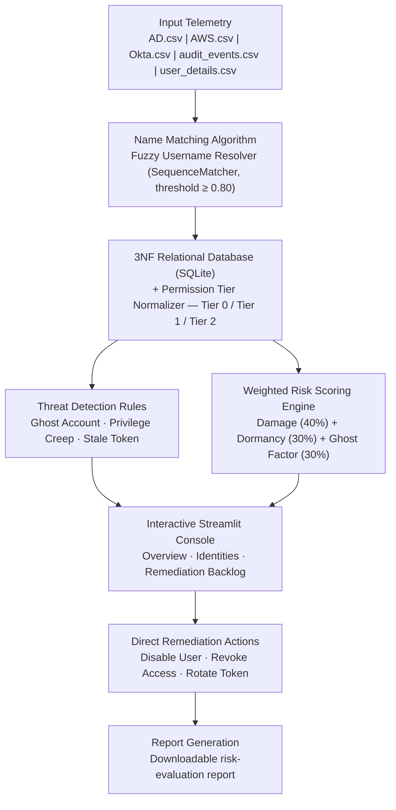

HybridGuard
Identity Security Posture Management (ISPM) for hybrid, multi-platform environments.
HybridGuard unifies identity and access data from HR, Active Directory, AWS IAM, and Okta into a single relational model, resolves inconsistent usernames back to one canonical identity, normalises privilege across platforms, and computes a transparent, weighted risk score for every identity — surfacing ghost accounts, privilege creep, and stale credentials before they're exploited.
> Built for **CyberCoders 2026** — a cybersecurity hackathon focused on practical tools that help detect, prevent, and respond to real-world security threats.
---
Table of Contents
Why HybridGuard
Architecture
Core Components
Name Matching Algorithm
Permission Tier Normalizer
Weighted Risk Scoring Engine
Threat Detection Rules
Project Structure
Tech Stack
Getting Started
Dashboard Pages
Database Schema
Self-Evaluation
Compliance Alignment
Roadmap
License
---
Why HybridGuard
Enterprises run identity across systems that were never built to talk to each other — HR knows who's employed, AD controls the network, AWS IAM and Okta control everything else. That gap creates real, measurable risk:
Ghost accounts — disabled in HR, still active on a platform.
Privilege creep — a standard employee quietly holding admin-level access.
Stale credentials — keys and tokens that are never rotated.
Stolen or compromised credentials remain the single largest initial-access vector in confirmed breaches (Verizon DBIR 2025), and credential-driven incidents take longer to detect than almost any other vector (IBM Cost of a Data Breach 2025) — because they don't look like an attack, they look like a valid login.
HybridGuard closes that gap: one pipeline, one risk score, one console.
---
Architecture
HybridGuard follows a seven-stage pipeline — ingest, resolve, normalise, detect/score, present, remediate, report.

> Diagram renders natively on GitHub. If you're viewing this elsewhere, a static export is available at `docs/architecture.png`.
---
Core Components
1. Name Matching Algorithm
Platform usernames are formatted inconsistently across AD, AWS, and Okta, with no shared key (`ahill`, `a.hill`, `allison.hill1`). The resolver:
Cleans each username — lower-cases it and strips non-alphabetic characters (`clean_username`).
Generates eight likely naming patterns per canonical HR identity, e.g. `johnsmith`, `jsmith`, `johns` (`generate_namepattern`).
Scores similarity against every pattern using `difflib.SequenceMatcher`.
Accepts a match only at a similarity ratio ≥ 0.80, linking the account to its canonical `identity_id`. Anything below threshold surfaces as a potential orphan account.
2. Permission Tier Normalizer
Every platform names privilege differently — `AdministratorAccess` on AWS, `Domain Admins` on AD, `SuperAdmin` on Okta. `normalize_role()` maps every raw role onto one shared scale so privilege becomes directly comparable across platforms:
Tier	Meaning	Examples
Tier 0	Full administrative control	Domain Admins, AdministratorAccess, SuperAdmin
Tier 1	Elevated / internal-tooling access	Server Operators, PowerUserAccess, InternalToolsAdmin
Tier 2	Standard user access	Domain Users, ReadOnlyAccess, User
A database view, `live_privileged_watchlist`, materialises every active Tier 0/1 account's effective privilege and dormancy duration for fast querying.
3. Weighted Risk Scoring Engine
Every identity gets a Unified Risk Score (0–100), combining three transparent, independently-inspectable components:
```
risk_score = (damage_score   × 0.40)   # highest privilege tier held
           + (dormancy_score × 0.30)   # days since last login
           + (ghost_factor   × 0.30)   # HR DISABLED but account ACTIVE
```
Component	Rule	Score
Damage Score	Tier 0 / Tier 1 / Tier 2	100 / 50 / 10
Dormancy Score	≥90 days / ≥60 days / ≥30 days inactive	100 / 50 / 10
Ghost Factor	HR `DISABLED` + platform account `ACTIVE`	100
Identities are tagged with readable risk factors — `high_privilege`, `dormant_account`, `ghost_account` — so the riskiest accounts surface to the top of the remediation backlog without manual triage.
4. Threat Detection Rules
Rule	Severity	Logic
Ghost Account	Critical	HR status `DISABLED`, platform account `ACTIVE`
Privilege Creep	High	Standard-tier HR employee holding Tier 0/1 access elsewhere
Stale Token	Medium	Active account, no recorded key/token rotation
---
Project Structure
```
HybridGuard/
├── backend/
│   ├── api.py                  # FastAPI REST endpoints
│   ├── db_connection.py        # SQLite connection helper
│   ├── normalize_and_match.py  # ETL: fuzzy matching + 3NF transform
│   └── security_insidents.py   # Threat detection + risk scoring engine
├── schema/
│   ├── simulate_data.py        # Synthetic data generator (250 identities)
│   ├── tables_creation.py      # Creates tables + live_privileged_watchlist view
│   └── clear_data.py           # Clears all tables
├── csvs/
│   ├── user_details.csv
│   ├── ad_users.csv
│   ├── aws_users.csv
│   ├── okta_users.csv
│   └── audit_events.csv
├── utils/
│   └── __init__.py             # path constants
├── utilss.py                   # CSS injection, pills, KPI cards, table renderers
├── dashboard.py                 # Streamlit app — 5 pages
├── newapp.py                    # Streamlit app — 4 pages (lightweight variant)
├── main.py                      # Orchestrator: clear → normalize → detect
├── self_evaluation.py           # Precision/Recall/F1 against ground truth
├── check_db.py                  # Debug script
├── hybridguard.db               # SQLite database (generated)
└── requirements.txt
```
---
Tech Stack
Layer	Technology
Language	Python 3.10+
Database	SQLite3 (3NF schema + analytical view)
Data handling	pandas, NumPy / SciPy
Identity resolution	`difflib.SequenceMatcher`
Dashboard	Streamlit + Plotly
API	FastAPI (REST, CORS-enabled)
---
Getting Started
Prerequisites
```bash
pip install -r requirements.txt
```
1. Generate synthetic data
```bash
python schema/simulate_data.py
```
2. Create the database schema
```bash
python schema/tables_creation.py
```
3. Run the ETL + threat detection pipeline
```bash
python main.py
```
This clears existing data, runs the fuzzy-matching ETL, and populates `security_incidents`.
4. Launch the dashboard
```bash
# Full 5-page dashboard
streamlit run dashboard.py

# Lightweight 4-page variant
streamlit run newapp.py
```
5. (Optional) Launch the API
```bash
uvicorn backend.api:myapp --reload
```
Endpoint	Method	Description
`/`	GET	All open security incidents
`/damage_score`	GET	Damage score per identity
`/dormancy_threat`	GET	Dormancy score per identity
---
Dashboard Pages
Page	Purpose
Overview	KPI summary + Top 10 Risk Identities, ranked by unified risk score
Dormancy Analysis	Inactivity distribution, dormancy heatmap by tier vs. HR status
Damage Score	Blast-radius analysis by privilege tier
Remediation Backlog	Filterable incident table with one-click Disable / Revoke / Rotate actions
Identities	Full risk-ranked identity table
---
Database Schema
Six relational tables in third normal form, plus one analytical view:
```
human_identities ──┐
platforms ─────────┼──> accounts ──> account_role_mapping ──> role_definitions
audit_events ───────┘

live_privileged_watchlist  (VIEW)
  → every active Tier 0/1 identity, highest tier held, days dormant
```
Table	Purpose
`human_identities`	HR master record — name, email, employment status
`platforms`	AD / AWS / Okta lookup
`accounts`	One row per platform account, linked to an identity
`role_definitions`	Raw role → normalised tier (0/1/2)
`account_role_mapping`	Links accounts to their role(s)
`audit_events`	Login / privilege-change history
`security_incidents`	Detected Ghost Account / Privilege Creep / Stale Token violations
---
Self-Evaluation
`self_evaluation.py` validates detection accuracy against known ground truth:
Backs up current data and database.
Generates 50 synthetic identities with known anomaly types (Ghost, Privilege Creep, Escalation, Token Abuse, Normal).
Re-runs the full pipeline.
Compares flagged identities against ground truth → Precision, Recall, F1, plus a per-anomaly-type breakdown.
Restores original data.
```bash
python self_evaluation.py
```
---
Compliance Alignment
NIST SP 800-53 (AC-2, AC-6) — continuous account lifecycle monitoring, least-privilege enforcement.
GDPR (Article 5, 32) — data minimisation via detection of access disproportionate to HR role.
CIS Controls 5 & 6 — standardised account and access auditing across the hybrid estate.
---
Roadmap
[ ] Live connectors for production AD / AWS IAM / Okta tenants (replace synthetic CSVs)
[ ] Slack / email alerting on new Critical incidents
[ ] Role-based access control for the console itself
[ ] Additional identity providers (Azure AD, Google Workspace)
---
License
This project is released under the MIT License — update this section with your team's chosen license before publishing.
---
Built for CyberCoders 2026 — a hackathon dedicated to practical, real-world cybersecurity tooling.
