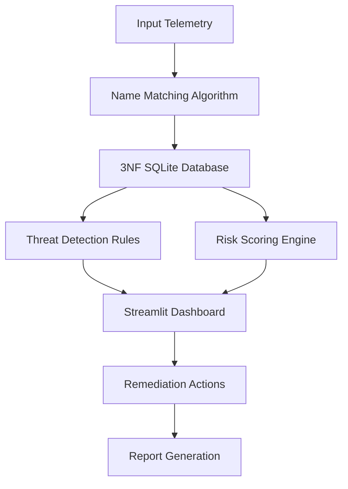

# HybridGuard

## Cross-Platform Identity Posture and Risk Dashboard

HybridGuard is an Identity Security Posture Management (ISPM) platform that unifies identity data from HR, Active Directory, AWS IAM, and Okta. It resolves usernames across systems, normalizes privilege tiers, computes a weighted risk score, and presents the results through an interactive dashboard with downloadable reports.

---

# Overview

Modern enterprises manage identities across multiple disconnected systems. HybridGuard provides a unified view of identities and privileges by combining data from:

- HR systems
- Active Directory
- AWS IAM
- Okta

The platform performs identity resolution, privilege normalization, threat detection, risk scoring, and remediation through a single dashboard.

---

# System Architecture

HybridGuard follows a seven-stage pipeline:

1. Telemetry Ingestion
2. Fuzzy Identity Resolution
3. 3NF Database Normalization
4. Permission Tier Mapping
5. Threat Detection and Risk Scoring
6. Interactive Dashboard
7. Report Generation



---

# Input Data Files

Five CSV files drive each analysis cycle.

| File | Description |
|--------|------------|
| `user_details.csv` | HR master list containing user details and employment status |
| `ad_users.csv` | Active Directory accounts and groups |
| `aws_users.csv` | AWS IAM users and attached policies |
| `okta_users.csv` | Okta accounts and role assignments |
| `audit_events.csv` | Login history and privilege changes |

Synthetic datasets are generated using:

```bash
python schema/simulate_data.py
```

---

# Methods

## 1. Name Matching Algorithm

Usernames often differ across platforms:

- `ahill`
- `a.hill`
- `allison.hill1`

HybridGuard resolves these inconsistencies using:

- `clean_username()`
- `generate_namepattern()`
- `difflib.SequenceMatcher`

A match is accepted when:

```python
similarity_ratio >= 0.80
```

Accounts that fail to meet the threshold are treated as potential orphan accounts.

---

## 2. Permission Tier Normalizer

Different platforms represent privileges differently:

| Platform | Example |
|-----------|---------|
| AWS IAM | AdministratorAccess |
| Active Directory | Domain Admins |
| Okta | SuperAdmin |

HybridGuard maps all roles into a common hierarchy.

| Tier | Description |
|------|------------|
| Tier 0 | Full administrative control |
| Tier 1 | Elevated or internal-tool access |
| Tier 2 | Standard user access |

This enables privilege comparison across platforms.

---

## 3. Risk Scoring Engine

Two independent signals are combined into a unified risk score.

### Damage Score

Based on highest privilege held.

| Tier | Score |
|------|------|
| Tier 0 | 100 |
| Tier 1 | 50 |
| Tier 2 | 10 |

Disabled users receive:

```python
damage_score = 0
```

### Dormancy Score

Based on inactivity.

| Days Since Login | Score |
|-----------------|------|
| ≥90 days | 100 |
| ≥60 days | 50 |
| ≥30 days | 10 |
| Otherwise | 0 |

### Overall Risk Score

```python
risk_score = (damage_score * 0.5) + (dormancy_score * 0.5)
```

Risk factors include:

- `high_privilege`
- `dormant_account`
- `ghost_account`

---

## 4. Threat Detection Rules

| Threat | Severity | Description |
|---------|---------|------------|
| Ghost Account | Critical | Disabled in HR but active on a platform |
| Privilege Creep | High | Standard employee possessing elevated privileges |
| Stale Token | Medium | No recorded credential rotation |

---

## 5. GUI Design and Remediation

HybridGuard provides two Streamlit applications:

### dashboard.py

Five-page dashboard:

- Overview
- Dormancy Analysis
- Damage Score
- Remediation Backlog
- Identities


The Remediation Backlog page supports:

- Access revocation
- Credential rotation

---

## 6. Report Generation

HybridGuard generates downloadable reports containing:

- Overall risk score
- Damage score
- Dormancy score
- Assigned risk factors
- Open security incidents

This provides transparency into why an identity was flagged.

---

# Key Features

- Unified risk score (0–100)
- Fuzzy username matching
- Cross-platform identity correlation
- Tier-based privilege normalization
- Automated threat detection
- Interactive Streamlit dashboard
- One-click remediation actions
- Downloadable risk evaluation reports

---

# Database Schema

HybridGuard uses a 3NF SQLite schema consisting of:

- `human_identities`
- `platforms`
- `accounts`
- `role_definitions`
- `account_role_mapping`
- `audit_events`
- `security_incidents`

Database:

```
hybridguard.db
```

---

# Project Structure

```text
HybridGuard/
│
├── backend/
│   ├── api.py
│   ├── db_connection.py
│   ├── normalize_and_match.py
│   └── security_incidents.py
│
├── schema/
│   ├── simulate_data.py
│   ├── tables_creation.py
│   └── clear_data.py
│
├── csvs/
│   ├── user_details.csv
│   ├── ad_users.csv
│   ├── aws_users.csv
│   ├── okta_users.csv
│   └── audit_events.csv
│
├── dashboard.py
├── newapp.py
├── main.py
├── self_evaluation.py
├── hybridguard.db
└── requirements.txt
```

---

# Technology Stack

| Layer | Technology |
|---------|-----------|
| Data Simulation | Python |
| Identity Resolution | `difflib.SequenceMatcher` |
| Storage | SQLite (3NF schema) |
| Risk Engine | Python weighted scoring model |
| Dashboard | Streamlit |
| API | FastAPI |
| Report Generation | Python |

---

# Getting Started

Install dependencies:

```bash
pip install -r requirements.txt
```

Generate synthetic data:

```bash
python schema/simulate_data.py
```

Create database tables:

```bash
python schema/tables_creation.py
```

Run the pipeline:

```bash
python main.py
```

Launch the dashboard:

```bash
streamlit run dashboard.py
```

Launch the API:

```bash
uvicorn backend.api:myapp --reload
```

---

# Repository

GitHub:

```
https://github.com/Jairamhegde/HybridGuard
```

Live Demo:

```
https://hybridguard-console.streamlit.app/
```

---
