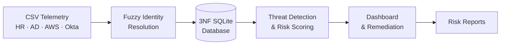

# HybridGuard

**Cross-platform identity posture and risk dashboard.**

**[Live Demo (Streamlit)](https://hybridguard-console.streamlit.app/)**

> **Status:** The live demo runs on Streamlit. The dashboard is currently being migrated to **React + FastAPI**, which is still in progress. The React frontend, FastAPI backend and localhost setup instructions in this repo belong to that migration.

---

## What It Is

HybridGuard is an Identity Security Posture Management (ISPM) tool. It pulls identity data from **HR, Active Directory, AWS IAM and Okta**, matches accounts that belong to the same person, normalizes privileges into a common hierarchy, and scores each identity's risk. Results are shown in a dashboard with one-click remediation and downloadable reports.

## What It Solves

Enterprises manage identities across disconnected systems. The same person may appear as `ahill`, `a.hill` and `allison.hill1`, and nobody has a single view of who holds which privileges. That makes the following hard to spot:

- **Ghost accounts:** employees disabled in HR who are still active on a platform
- **Privilege creep:** standard employees holding elevated access
- **Dormant accounts:** unused accounts that stay open as attack surface

HybridGuard gives security teams one prioritized view of these risks and explains why each identity was flagged.

---

## How It Works


```mermaid
flowchart LR
    A["CSV Telemetry<br/>HR · AD · AWS · Okta"] --> B["Fuzzy Identity<br/>Resolution"]
    B --> C[("3NF SQLite<br/>Database")]
    C --> D["Threat Detection<br/>& Risk Scoring"]
    D --> E["Dashboard<br/>& Remediation"]
    E --> F["Risk Reports"]
```

### Core Algorithms

**1. Fuzzy identity resolution**
Usernames are cleaned and reduced to a name pattern, then compared using `difflib.SequenceMatcher`. A match is accepted at a similarity ratio of **0.80 or higher**. Accounts below the threshold are flagged as potential orphan accounts.

**2. Privilege tier normalization**
Platform-specific roles are mapped to one hierarchy so privileges can be compared across systems.

| Tier | Meaning | Examples |
|------|---------|----------|
| Tier 0 | Full administrative control | `AdministratorAccess`, `Domain Admins`, `SuperAdmin` |
| Tier 1 | Elevated or internal-tool access | |
| Tier 2 | Standard user access | |

**3. Weighted risk scoring (0–100)**

```python
risk_score = (damage_score * 0.5) + (dormancy_score * 0.5)
```

| Damage score (highest privilege) | | Dormancy score (days since login) | |
|---|---|---|---|
| Tier 0 | 100 | 90 or more | 100 |
| Tier 1 | 50 | 60 or more | 50 |
| Tier 2 | 10 | 30 or more | 10 |
| Disabled user | 0 | Under 30 | 0 |

Each identity is tagged with risk factors: `high_privilege`, `dormant_account`, `ghost_account`.

**4. Rule-based threat detection**

| Threat | Severity | Rule |
|--------|----------|------|
| Ghost Account | Critical | Disabled in HR but active on a platform |
| Privilege Creep | High | Standard employee holding elevated privileges |
| Stale Token | Medium | No recorded credential rotation |

---

## Features

- Unified risk score across four platforms
- Cross-platform identity correlation
- Automated threat detection
- Dashboard pages: Overview, Dormancy Analysis, Damage Score, Remediation Backlog, Identities
- One-click remediation: access revocation and credential rotation
- Downloadable reports with overall, damage and dormancy scores, risk factors and open incidents

## Tech Stack

| Layer | Technology |
|-------|------------|
| Language | Python |
| Identity matching | `difflib.SequenceMatcher` |
| Database | SQLite (3NF schema) |
| Live dashboard | Streamlit |
| Migration in progress | FastAPI + Uvicorn (API), React 19 + Vite + Recharts + Lucide (frontend) |

## Database Schema

`hybridguard.db` uses a 3NF schema:

`human_identities` · `platforms` · `accounts` · `role_definitions` · `account_role_mapping` · `audit_events` · `security_incidents`

## Input Data

Five CSV files drive each analysis run. Synthetic data is generated by `schema/simulate_data.py`.

| File | Contents |
|------|----------|
| `user_details.csv` | HR master list with employment status |
| `ad_users.csv` | Active Directory accounts and groups |
| `aws_users.csv` | AWS IAM users and attached policies |
| `okta_users.csv` | Okta accounts and role assignments |
| `audit_events.csv` | Login history and privilege changes |

---

## Getting Started

```bash
git clone https://github.com/Jairamhegde/HybridGuard.git
cd HybridGuard
pip install -r requirements.txt
npm install

python schema/simulate_data.py      # generate synthetic data
python schema/tables_creation.py    # create the database
python main.py                      # run matching, scoring and detection
```

**Run the React + FastAPI version (migration in progress)**

```bash
npm run dev
```

This starts the API at `http://127.0.0.1:8000` and the React console at `http://localhost:5173`.

To run them separately:

```bash
python -m uvicorn backend.api:app --reload --port 8000   # from the repo root
cd priviguard-dashboard && npm run dev                   # in a second terminal
```

## Project Structure

```text
backend/        api.py (FastAPI), db_connection.py, normalize_and_match.py, security_incidents.py
schema/         simulate_data.py, tables_creation.py, clear_data.py
csvs/           input telemetry files
dashboard.py    Streamlit dashboard (live)
priviguard-dashboard/   React dashboard (in progress)
main.py         pipeline entrypoint
hybridguard.db  SQLite database
```

## Repository

[github.com/Jairamhegde/HybridGuard](https://github.com/Jairamhegde/HybridGuard)